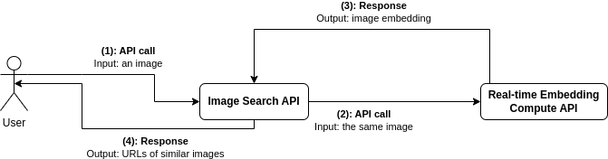

# Develop & Deploy an Image-to-Image search service homework

This is a repository for the Week 3 - homework of Cinnamon AI Bootcamp 2024

Group Assignment: Develop & Deploy an Image-to-Image search service from COCO 128 dataset

- Requirements:
  - AI Models: Use CLIP for image encoding and FAISS for the search algorithm.
  - APIs: At least 2 API Services (one for encoding and one for searching).
  - Input: One or more image.
  - Output: Most similarity images in your database.
  - Deployment: Deploy your APIs on AWS and provide the final endpoint.
  - Document: README with overview design of your APIs system.

Overview system design



## Repository structure

```
├── common
│   └── data
│       └── images                    // dataset directory
└── services                          // services source code
    ├── image_search
    ├── pre-compute_embeddings
    └── real-time_compute_embeddings
```
## Summary

For usage:
```shell
docker compose up -d
```

## Image Search embedding service

This service hosts an Image Search API using embedding of `real-time-compute embedding service`.

This is the [endpoint](http://34.209.51.63:8000/docs#/default/search_similar_images_search_similar_images__post)

## Pre-compute embedding service

This service is used for pre-computing the embedding of a list of images.

## Real-time-compute embedding service

This service hosts an Embedding Computation API using `ViT-B/32` model with [CLIP](https://github.com/openai/CLIP) library.

`/compute_embedding`

> Endpoint to compute CLIP embeddings for multiple uploaded images.
>
> **Args**: files (List[UploadFile]): A list of uploaded image files.
>
> **Returns**: EmbeddingResponse (list[list[float]]): A JSON response containing the computed image embeddings.

Building Docker image

```shell
docker build . -t real-time_compute_embeddings -f services/real-time_compute_embeddings/Dockerfile
```

Running Docker image

- with CPU

```shell
docker run -p 8080:8080 -d real-time_compute_embeddings
```

- with GPU (you need to install [nvidia-container-toolkit](https://docs.nvidia.com/datacenter/cloud-native/container-toolkit/latest/install-guide.html) for using docker with GPU)

```shell
docker run -p 8080:8080 --gpus all -d real-time_compute_embeddings
```

## Output
The system will return top k of the most similar images in format base64 url.